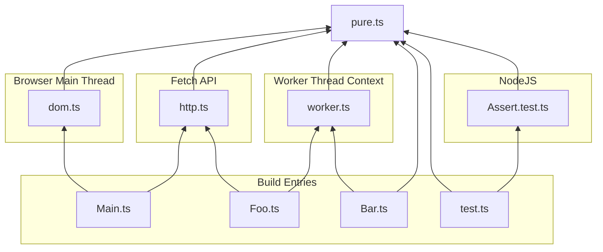
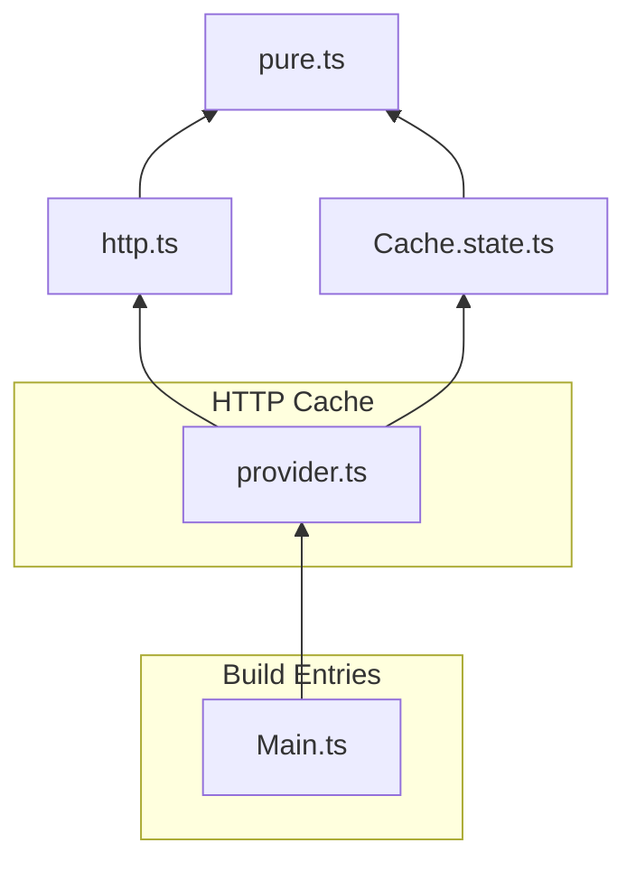
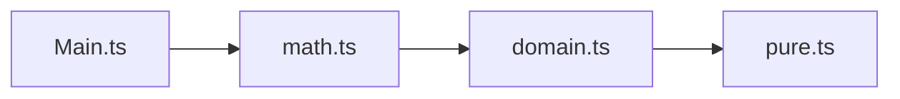
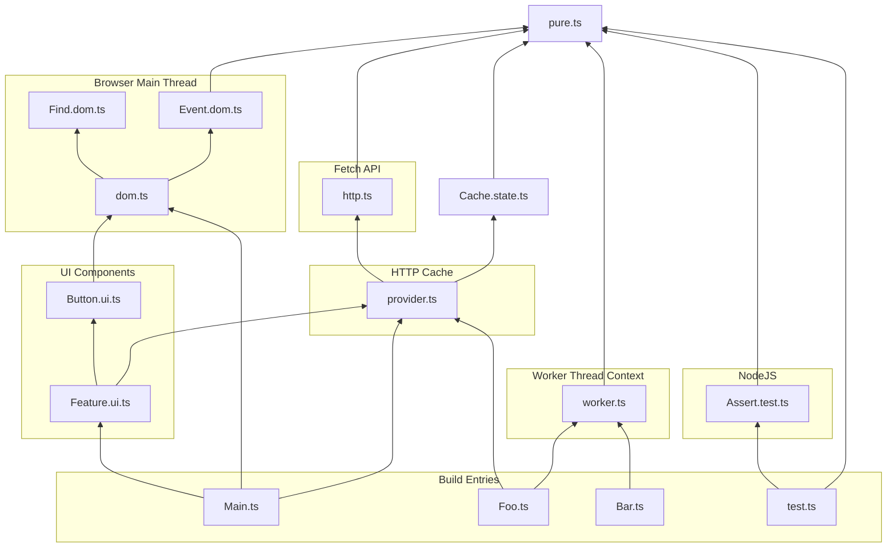

# Purity Seal Examples
### Isolate Runtime Platforms

```ts
const graph = PuritySeal.Classify({
	Unit: ["pure"],
	Commutative: ["http"],
	Exclusive: ["dom", "test", "worker"],
})
```

### Enforce Onion Architecture

```ts
const graph = PuritySeal.Classify({
	Unit: ["pure"],
	Commutative: ["http", "state"],
	Composite: [
		["provider", ["http", "state"]],
	],
})
```

### Separate Business Logic from Library

```ts
const graph = PuritySeal.Classify({
	Unit: ["pure"],
	Directional: [
		{ dependent: "domain", dependency: "pure" },
		{ dependent: "math", dependency: "pure" },
		{ dependent: "math", dependency: "domain" },
	],
})
```

### The Kitchen Sink

```ts
const graph = PuritySeal.Classify({
	Unit: ["pure"],
	Exclusive: ["dom", "test", "worker"],
	Commutative: ["http", "state"],
	Composite: [
		["provider", ["http", "state"]],
		["ui", ["provider", "dom"]],
	],
	Directional: [
		{ dependent: "domain", dependency: "pure" },
		{ dependent: "math", dependency: "pure" },
		{ dependent: "math", dependency: "domain" },
	],
})
```
