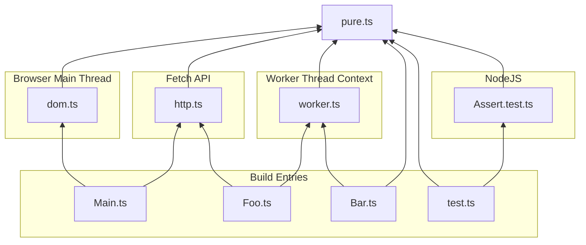
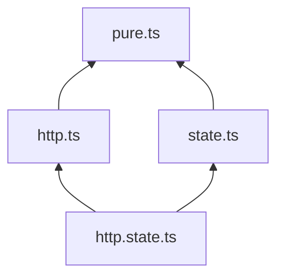
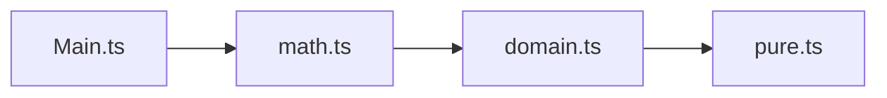
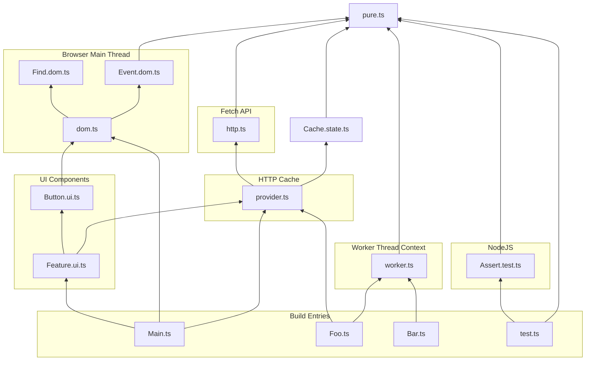

# Purity Seal Examples
- [Isolate Runtime Platforms](#isolate-runtime-platforms)
- [Enforce Onion Architecture](#enforce-onion-architecture)
- [Separate Business Logic from Library](#separate-business-logic-from-library)
- [The Kitchen Sink](#the-kitchen-sink)
- [Alternative](#alternative)
- [Reclassify](#reclassify)

### Isolate Runtime Platforms

```ts
const graph = PuritySeal.Classify({
	Unit: ["pure"],
	Commutative: ["http"],
	Exclusive: ["dom", "test", "worker"],
})
```

### Enforce Onion Architecture

```ts
const checker = Result.GetOrThrow(PS.Compare.ClassifyAndCompare(
	PS.Classify.File.FromExtensions(["http.state", "pure", "state", "http"]),
	PS.Compare.PartialOrder.Make([
		["http.state", ["state", "http"], "pure"],
	]),
))
```

### Separate Business Logic from Library

```ts
const graph = PuritySeal.Classify({
	Unit: ["pure"],
	Directional: [
		{ Dependent: "domain", Dependency: "pure" },
		{ Dependent: "math", Dependency: "pure" },
		{ Dependent: "math", Dependency: "domain" },
	],
})
```

### The Kitchen Sink

```ts
const graph = PuritySeal.Classify({
	Unit: ["pure"],
	Exclusive: ["dom", "test", "worker"],
	Commutative: ["http", "state"],
	Composite: [
		["provider", ["http", "state"]],
		["ui", ["provider", "dom"]],
	],
	Directional: [
		{ Dependent: "domain", Dependency: "pure" },
		{ Dependent: "math", Dependency: "pure" },
		{ Dependent: "math", Dependency: "domain" },
	],
})
```

### Alternative
For a given dependency and dependent, re-try using a different graph.
```ts
const allowExternal = PuritySeal.AsksWhen(
	x => x.Dependency.startsWith("node_modules"),
	PuritySeal.Allow(),
)
const allowKludge = PuritySeal.AsksWhen(
	x => x.Dependent === "filepath1" && (
		x.Dependency.includes("subpath1")
		|| x.Dependency.includes("subpath2")
	),
	PuritySeal.Allow(),
)
const graph = Pipe(
	PuritySeal.Classify({ Unit: ["pure"] }),
	PuritySeal.Alternative(allowExternal),
	PuritySeal.Alternative(allowKludge),
)
```

### Reclassify
Logically re-map a dependency to a new set of file extensions before validating against the graph.
```ts
const barHTTP = PuritySeal.Reclassify(
	dependency => dependency.startsWith("node_modules/bar"),
	["http"],
)
const graph = PuritySeal.Classify({
	Unit: ["pure"],
	Commutative: ["http", "state"],
	Reclassify: [barHTTP],
})
```
