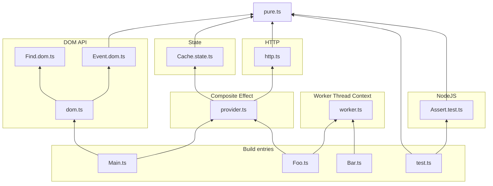

# purity-seal
Language-agnostic dependency graph validation tool. Useful for fencing directories or enforcing architectural constraints.

# Examples
### Enforce Onion/Pure Architecture


```ts
const onionArchitecture = PuritySeal.Classify({
	Pure: ["pure"],
	Platforms: ["dom", "test", "worker"],
	Effects: ["http", "state"],
	Composite: [
		["provider", ["http", "state"]],
	],
})
```
