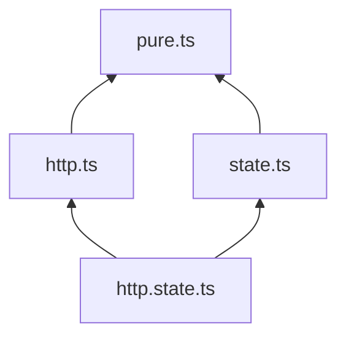
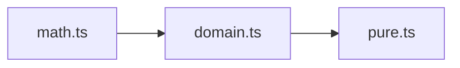
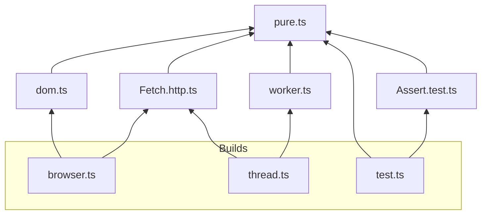
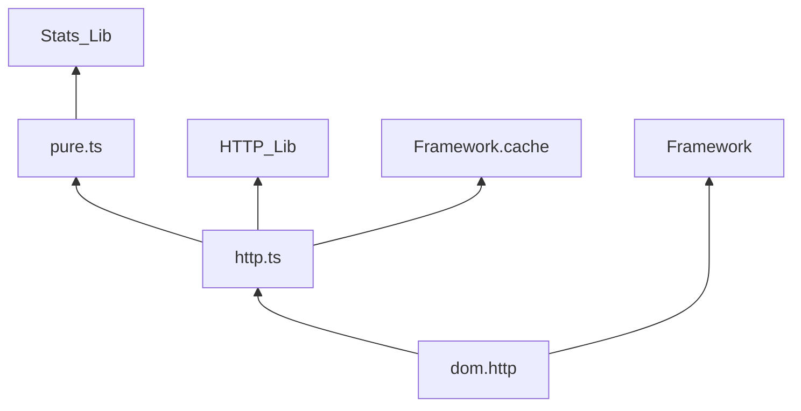

# Purity Seal Examples
- [Enforce Onion Architecture](#enforce-onion-architecture)
- [Separate Business Logic from Library](#separate-business-logic-from-library)
- [Isolate Runtime Platforms](#isolate-runtime-platforms)
- [Multiple Classifiers](#multiple-classifiers)
- [Alternative](#alternative)

### Enforce Onion Architecture

```ts
const classify = PS.Classify.Extensions(["pure", "state", "http"])
const po = PS.PartialOrder.Make([
	[["http.state", "state.http"], ["state", "http"], "pure"],
])
const check = PS.Pipe(
	PS.Checker.BuildChecker(classify)(po),
	PS.Plugin.Esbuild,
)
```

### Separate Business Logic from Library

```ts
const classify = PS.Classify.Extensions(["pure", "math", "domain"])
const po = PS.PartialOrder.Make([
	["math", "domain", "pure"],
])
const check = PS.Pipe(
	PS.Checker.BuildChecker(classify)(po),
	PS.Plugin.Esbuild,
)
```

### Isolate Runtime Platforms

```ts
const classify = PS.Classify.Extensions([
	"pure", "http", "dom", "worker", "test", "browser", "thread",
])
const po = PS.PartialOrder.Make([
	["browser", ["http", "dom"], "pure"],
	["thread", ["http", "worker"], "pure"],
	["test", "pure"],
])
const check = PS.Pipe(
	PS.Checker.BuildChecker(classify)(po),
	PS.Plugin.Esbuild,
)
```

### Multiple Classifiers
Third party code may follow different conventions.

```ts
const libStats = PS.Classify.SetWhen(
	filepath => filepath.startsWith("node_modules/Stats"),
	_filepath => "pure",
)
const libHttp = PS.Classify.SetWhen(
	filepath => filepath === "node_modules/FancyHTTP/index.ts",
	_filepath => "http",
)
const libGlob = PS.Classify.SetWhen(
	filepath => filepath.startsWith("node_modules/framework"),
	filepath => filepath.includes("cache") ? "http" : "dom.http",
)
const classify = PS.Pipe(
	PS.Classify.Extensions(["pure", "http", "dom"]),
	PS.Classify.Catch(libStats),
	PS.Classify.Catch(libHttp),
	PS.Classify.Catch(libGlob),
)
const po = PS.PartialOrder.Make([
	["dom.http", ["dom", "http"], "pure"],
])
const check = PS.Pipe(
	PS.Checker.BuildChecker(classify)(po),
	PS.Plugin.Esbuild,
)
```

### Alternative
For a given dependency and dependent, explicitly allow or deny.
```ts
const whitelist = new Set(["Source/index.ts"])
const allowWhiteList = PS.Checker.AsksWhen(
	([x, y]) => whiteList.includes(x) || whiteList.includes(y),
	PS.Checker.Allow(),
)
const classify = PS.Pipe(
	PS.Classify.Extensions(["pure", "http"]),
	PS.Classify.Catch(libHttp),
	PS.Classify.Catch(libStats),
)
const po = PS.PartialOrder.Make([
	["http", "pure"],
])
const check = PS.Pipe(
	PS.Checker.BuildChecker(classify)(po),
	PS.Checker.Then(allowWhiteList)
	PS.Plugin.Esbuild,
)
```
